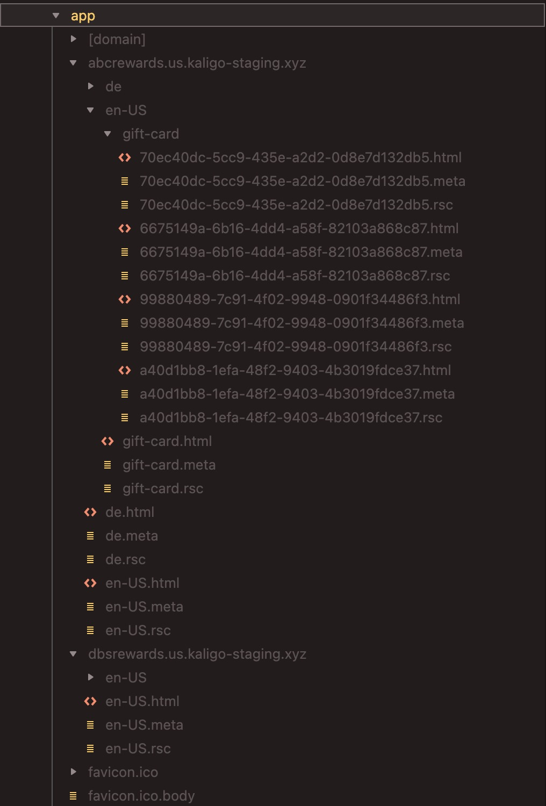

# Multi-tenant multi-language Next.js app

A Next.js 13 appDir application that supports multi-tenant and multi-language and uses ISR to generate static pages.

## Getting Started

First, run the development server:

```bash
cp .env.local.example .env.local
pnpm install && pnpm dev
# or production mode
pnpm install && pnpm build && pnpm start
```

Open one of these URLs with your browser to see the result.

- [http://abcrewards.localhost:3000](http://abcrewards.localhost:3000)
- [http://dbsrewards.localhost:3000](http://dbsrewards.localhost:3000)

## Inspect ISR output

I would recommend using product mode to run the app. It will help you inspect the ISR output more easily.

- Start the app in the production mode

```bash
pnpm install && pnpm build && pnpm start
```
- Open one of these URLs with your browser to see the result.
  - [http://abcrewards.localhost:3000](http://abcrewards.localhost:3000)
  - [http://dbsrewards.localhost:3000](http://dbsrewards.localhost:3000)
- Inspect the ISR output by opening the .next/server/app folder. You should see the below structure


