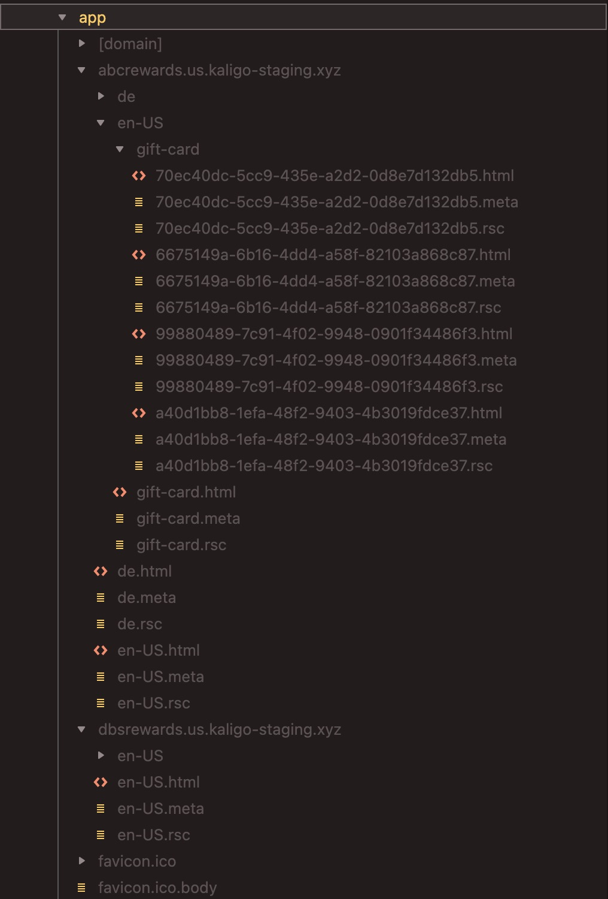

# Multi-tenant multi-language Next.js app

This is a [Next.js](https://nextjs.org/) project bootstrapped with [`create-next-app`](https://github.com/vercel/next.js/tree/canary/packages/create-next-app).

## Getting Started

First, run the development server:

```bash
pnpm install && pnpm dev
# or production mode
pnpm install && pnpm build && pnpm start
```

Open one of these URLs with your browser to see the result.

- [http://abcrewards.localhost:3000](http://abcrewards.localhost:3000)
- [http://dbsrewards.localhost:3000](http://dbsrewards.localhost:3000)

## Inspect ISG output

I would recommend using product mode to run the app. It will help you inspect the SSG output easier.

- Start the app in the production mode

```bash
pnpm install && pnpm build && pnpm start
```

- Inspect the SSG output by opening the .next/server/app folder. You should see the below structure


